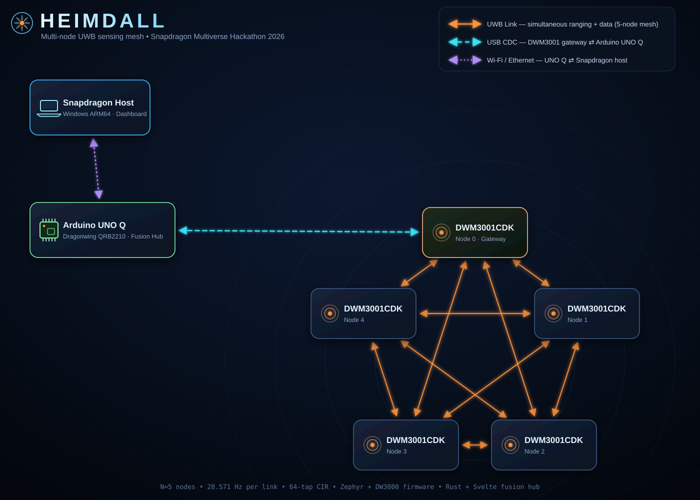

# Heimdall

> Entry for the **Snapdragon Multiverse Hackathon 2026** (Qualcomm, San Diego).

Heimdall is a room-scale, multi-node UWB sensing and scene-reconstruction
system built around DWM3001 radios and an Arduino UNO Q gateway.



## Application description

Multiple fixed DWM3001 nodes exchange scheduled UWB beacons. Each node records
peer observations, including timestamps, CFO, range metadata, and CIR windows.
One node is attached to an Arduino UNO Q over USB CDC. The UNO Q acts as the
fusion hub: it receives the UWB backhaul, validates and archives observations,
estimates geometry, and runs the sensing pipeline. A live dashboard shows
distance, CIR, and spectrum streams, a 3D board-position solve, and a radar-map
reconstruction of the environment, all computed on-device.

## Team

| Name | Email (@gmail.com)|
| --- | --- |
| Anand Guruswamy | anand.me |
| Ehsan Hosseini | ehsan.hosseini |
| Jianxiu Li | lijianxiu2019 |
| Saisundar Sridharan | saisundar2  |
| Simarjit Singh | simar.rajput |

## Current status

- The N=5/M=2 radio profile is hardware-qualified with all five nodes active.
  Each 35 ms cycle provides 20 directed links at 28.571 Hz with 64 complex CIR
  taps per observation.
- The gateway exports the full roster over native USB CDC without steady-state
  loss at the modeled 187,200 B/s load while keeping radio timing independent
  of USB backpressure.
- The Rust service validates, archives, and replays observations and serves the
  live DSP dashboard. The deployed split path can forward validated records
  from the UNO Q agent to the server over direct Ethernet or Wi-Fi.
- Range/CIR processing, board-geometry estimation, and experimental 3D
  multistatic backprojection are implemented. Compact neural scene
  reconstruction is specified as a research direction, not yet a validated
  sensing result.
- Per-board antenna-delay and phase-center calibration remain outstanding, so
  current timestamps must not be presented as accurate metric ranges.

Radio firmware uses the open Zephyr + DW3000 driver path. The closed FiRa/BLE
experiments remain useful for lessons and fixtures, but BLE is not the Heimdall
data plane. See [STATUS.md](STATUS.md) for detailed build, deployment, and
hardware-validation records.

## Setup instructions

The system has three buildable parts: node/gateway radio firmware, the UNO Q
Linux runtime (Rust service + embedded Svelte dashboard), and host-side
analysis tools.

### Prerequisites

Hardware:

- 5x DWM3001CDK nodes (DWM3001CDK/nRF52833, DW3110 radio).
- 1x Arduino UNO Q as the fusion hub/gateway host.
- 1x J-Link (J9 connection) for programming boards, optionally hosted on the
  UNO Q.

Host (a Windows ARM64 Copilot+ PC is the validated build machine):

- Python 3.12 (for west/Zephyr and the reference Python suite).
- Rust 1.93.1 with the `aarch64-pc-windows-gnullvm` host toolchain and the
  `aarch64-unknown-linux-gnu` target, plus Zig 0.15.2 for cross-linking.
- Node.js 24.x and npm 11.x (dashboard build).
- For firmware: west 1.5.0, CMake 3.31.10, Ninja 1.13.x, DeviceTree compiler
  1.6.x, Zephyr SDK 0.17.4 with the `arm-zephyr-eabi` toolchain, 7-Zip, and
  wget.

Every host tool and the exact cached assets and checksums are documented in
[tools/README.md](tools/README.md). Installers are cached under the ignored
`tools/installers/` directory.

### 1. Firmware

From the repository root, initialize the west workspace and build the radio
application:

```powershell
cd firmware
west init -l radio
west update
west build -p always --no-sysbuild -b nrf52833dk/nrf52833 radio/app -d build-radio -- "-DOVERLAY_CONFIG=radio/app/usb.conf"
```

The default build uses the 8 MHz SPI rollback overlay. The 32 MHz SPIM3 profile
(used by the validated deployment) adds the absolute overlay path documented in
[docs/firmware-onboarding.md](docs/firmware-onboarding.md). Node-specific images
are bound at build time to a node ID, the board's FICR `DEVICEID` words, and
per-board antenna delays; see `deployment/node-roster.lab.yaml` and
`deployment/beacon-config.n5.json` for the current N=5/M=2 profile.

Flash each board through J9 with J-Link:

```bash
printf 'connect\nloadfile /tmp/heimdall-boardN.hex\nr\ng\nq\n' \
  | JLinkExe -device nRF52833_xxAA -if SWD -speed 4000 -SelectEmuBySN <jlink-serial>
```

### 2. UNO Q Rust service

Build the Debian ARM64 release on the Windows host (never on the UNO Q):

```powershell
.\tools\build-linux-arm64.ps1 -Release
```

The deployable binary is written to
`target/aarch64-unknown-linux-gnu/release/heimdall-service`. The Svelte
dashboard is embedded at build time; rebuild it first if the UI changed:

```sh
cd unoq/dashboard
npm install
npm run check
npm run build
```

### 3. Deployment

Transfer the binary to the UNO Q and deploy with the tracked launcher:

```bash
scp target/aarch64-unknown-linux-gnu/release/heimdall-service \
  arduino@<unoq-ip>:/home/arduino/.local/bin/heimdall-service
```

`unoq/deploy/run-heimdall.sh` starts the service; a systemd unit
(`unoq/deploy/heimdall.service`) and a rootless `@reboot` crontab launcher are
provided. The UNO Q connects over SSH as `arduino@<unoq-ip>`; see AGENTS.md.

## Run and usage instructions

### Live system

1. Power the DWM3001 nodes and the gateway node; the gateway node must be
   attached to the UNO Q over native USB CDC (J20).
2. Start `heimdall-service` on the UNO Q (`deploy/run-heimdall.sh`), or in the
   split path run `heimdall-service agent` on the UNO Q and `heimdall-service
   server` on the Windows host to view the dashboard locally.
3. Open the dashboard at `http://<host>:8080`. Eight tabs show distance,
   CIR, waterfall, FFT, CFO, board positions, the radar map, and the
   seat-occupancy simulator/training.
4. Health and topology: `GET /api/health` and `GET /api/topology`.

Runtime data is stored on the UNO Q under `/home/arduino/heimdall-data`.

### Capture and replay

- Arm a protected 30-second capture: `POST /api/v1/clips`; poll with
  `GET /api/v1/clips`; download or delete with `GET|DELETE /api/v1/clips/{id}`.
- Replay canonical observations from a `.husb` capture through the reference
  Python path:

```bash
python3 -m heimdall.replay_ingest data/raw/connection-000001 data/replay.sqlite3
python3 -m heimdall.verify_h3 data/heimdall.sqlite3 data/raw data/replay.sqlite3
```

- `host-tools/radar-map/` replays captures into 3D multistatic backprojection
  volumes and serves XY/XZ/YZ slices.

See [docs/operations.md](docs/operations.md) for run metadata requirements and
recovery procedures.

## Tests

- Protocol/contract suite (Python): `python -m pytest tests/`
- Rust unit tests: `.\tools\test-host.ps1`; cross-compiled UNO Q tests:
  `.\tools\test-linux-arm64.ps1`
- Frontend checks and build: `npm run check && npm run build` in
  `unoq/dashboard`
- Live acceptance audit across desktop and phone: from `unoq/dashboard`,
  `npm run audit:live -- "http://<host>:8080" /tmp/heimdall-tab-audit`

## Notes

- Radio timing is kept independent of USB backpressure by design; the gateway
  uses bounded, drop-newest queues with sequence-visible producer drops.
- Every record carries a protocol version, node identity, round identity,
  sequence information, and integrity check. See `contracts/`.
- Per-board antenna-delay calibration is required before timestamps are treated
  as accurate metric ranges; current boards use the bring-up value.

## Read first

- [docs/architecture.md](docs/architecture.md)
- [docs/protocol.md](docs/protocol.md)
- [docs/lessons-learned.md](docs/lessons-learned.md)
- [docs/bring-up-plan.md](docs/bring-up-plan.md)
- [STATUS.md](STATUS.md)

## Project map

- `firmware/`: node and gateway radio firmware.
- `contracts/`: versioned wire and semantic contracts.
- `unoq/`: UNO Q ingest, fusion, storage, and dashboard.
- `host-tools/`: capture, decode, and analysis utilities.
- `tests/`: protocol, replay, and fusion tests.
- `captures/`: local raw and processed data; ignored by default.
- `deployment/`: node roster, slot plan, and UNO Q configuration.

## Technical papers

- [Offset-Free Joint Time-of-Flight, Clock-Rate, and Clock-Drift Estimation](docs/papers/joint-tof-clock-estimation.html)
- [Geometry-Conditioned Neural 3D Scene Reconstruction from Multistatic UWB Channel Impulse Responses](docs/papers/neural-uwb-scene-reconstruction.html)

## References

- Zephyr RTOS and the open DW3000 driver (pinned in `firmware/radio/west.yml`).
- DWM3001CDK and DW3110 documentation from Qorvo.
- [docs/papers/](docs/papers/) for the ranging and reconstruction techniques
  behind the processing pipeline.

## License

Heimdall is licensed under the [MIT License](LICENSE).
